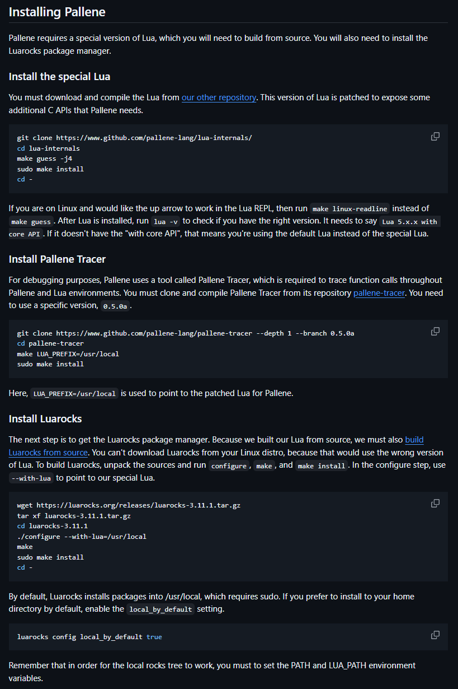
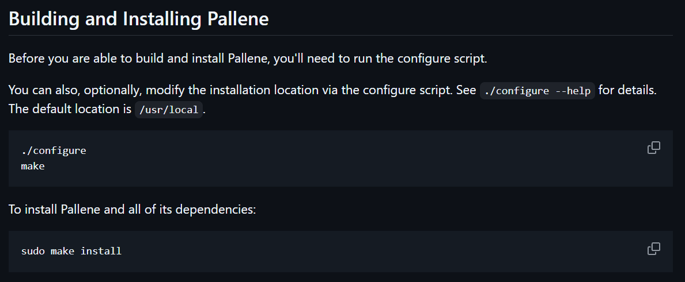

# Google Summer of Code 2026

## Introduction

My name is Ninad Sachania, and I work at HSBC as a Senior Software Engineer.
I was selected as a contributor for the project [Improving the Pallene Installer](https://github.com/labluapucrio/gsoc/blob/main/2026/ideas.md#improve-the-pallene-installer) at LabLua Foundation.
My mentors were Hugo Musso Gualandi and Luiz Romário Santana Rios.

## Project Summary

Pallene is a typed dialect of Lua designed for writing fast code that interoperates with Lua.
Because it modifies the Lua runtime, Pallene can't run on top of a stock Lua installation.
It needs a patched version of the Lua interpreter and a handful of runtime libraries written in C.

The old build process involved several manual steps.
Users had to build and install some dependencies by hand, while LuaRocks pulled in the rest.

The goal of this GSoC project was to design a simpler and more accessible process for building and installing Pallene.
This involved vendoring all the dependencies, writing new scripts for building and installing, updating the CI script, and updating the documentation.

We delivered all of it.
Pallene now builds and installs with just three commands, and none of them download anything from outside the repository.
Along the way we also simplified Pallene Tracer and fixed a bug in it, and we've nearly finished upgrading Pallene's Lua from 5.4.7 to 5.5.0.

## Work Completed

The first thing we did was to vendor all four dependencies of Pallene:

- The custom Lua that exposes internal APIs required by Pallene
- Pallene Tracer
- Argparse
- LPeg

Next, we created a Makefile to build all the dependencies, build Pallene, and install it on the user's computer.
We also added a configure script so users can customize the install location, binary names, and so on.

We updated the [README.md](https://github.com/pallene-lang/pallene/blob/master/README.md) to reflect the new steps.

We added a file [VENDORING.md](https://github.com/pallene-lang/pallene/blob/master/deps/VENDORING.md) to hold all documentation about the vendored dependencies.
It documents how to add, delete, or modify a vendored dependency.
It also contains the following information about the dependencies:

- Name
- Upstream source URL
- Version (release tag or the version string)
- Commit hash and the branch it was taken from, if vendored from a Git checkout

We updated the CI script to match the new steps.

We removed LuaRocks as a dependency for building and installing Pallene.

The custom Lua used to live in its own repository, which meant keeping the two in sync.
We moved it into the Pallene repository.

We also built Pallene on macOS and noted the changes the build process needs to work there.

Here's the [PR](https://github.com/pallene-lang/pallene/pull/678) that contains all this work.

## Testing

Throughout the project, we tested the new steps on Linux and WSL2.
Docker images let us verify the build on a machine with nothing pre-installed, which is the case that matters most for a first-time user.

## Benefits

### Simplified Build Process

The main benefit of this overhaul was that we simplified the build process significantly.
We went from requiring multiple complicated steps that involved downloading and installing a bunch of dependencies to just **three** commands to build _and_ install Pallene:

Before                                                               |  After
:-------------------------------------------------------------------:|:-----------------------------------------------------------------:
  |  

### Reduced Supply-Chain Exposure

Because all the dependencies now live inside the repository, the build fetches no code at build time, and every dependency update becomes a reviewable change in-tree rather than a silent one.

### Fewer Dependencies

We removed LuaRocks as a dependency for building and installing Pallene.
Note that we still use it for testing and linting.

### Shorter Build Times

The build times are much shorter now that the user doesn't have to manually download and build a number of dependencies before being able to build Pallene.

On my machine, the old process took 1–2 minutes, most of it spent on manual steps. Now it takes under 5 seconds.

### Improved Robustness

Vendoring dependencies also means we don't rely on third-party services (like a module repository or GitHub) being available to build Pallene.

We experienced this ourselves. Pallene Tracer's CI started failing because it wasn't able to fetch Lua's source code. I tracked down the root cause to [lua.org](https://lua.org) being offline.

## Drive-by Contributions

### Pallene Tracer

We found and fixed a bug where the uninstall step removed the wrong binary in Pallene Tracer.
Here's the [PR](https://github.com/pallene-lang/pallene-tracer/pull/29).

We also simplified Pallene Tracer and made it easier to upgrade the Lua-specific code that Pallene Tracer requires.
This resulted in a new release, 0.6.0.
Here's the [PR](https://github.com/pallene-lang/pallene-tracer/pull/31).

### Xjump

My mentors encouraged me to borrow the configure script from one of their projects, [xjump-sdl](https://github.com/hugomg/xjump-sdl).
While I was adapting it for Pallene, I found several typos and upstreamed the fixes.
Here's the [PR](https://github.com/hugomg/xjump-sdl/pull/9).

## Further Work

We have started working on upgrading Pallene's Lua version from 5.4.7 to 5.5.0.
It's almost done, and we expect to merge it in the next couple of weeks.
Here's the [PR](https://github.com/pallene-lang/pallene/pull/677).

## Acknowledgements

I want to thank both of my mentors for guiding me throughout the project.
They were always available (via Matrix or video) to help me understand code, provide valuable feedback, review my PRs, and brainstorm ideas.
Because of their guidance and help, I was able to finish this project successfully and without any worries.

I would also like to thank the LabLua Foundation and Google for providing me with this opportunity to contribute to a project as interesting as Pallene.

